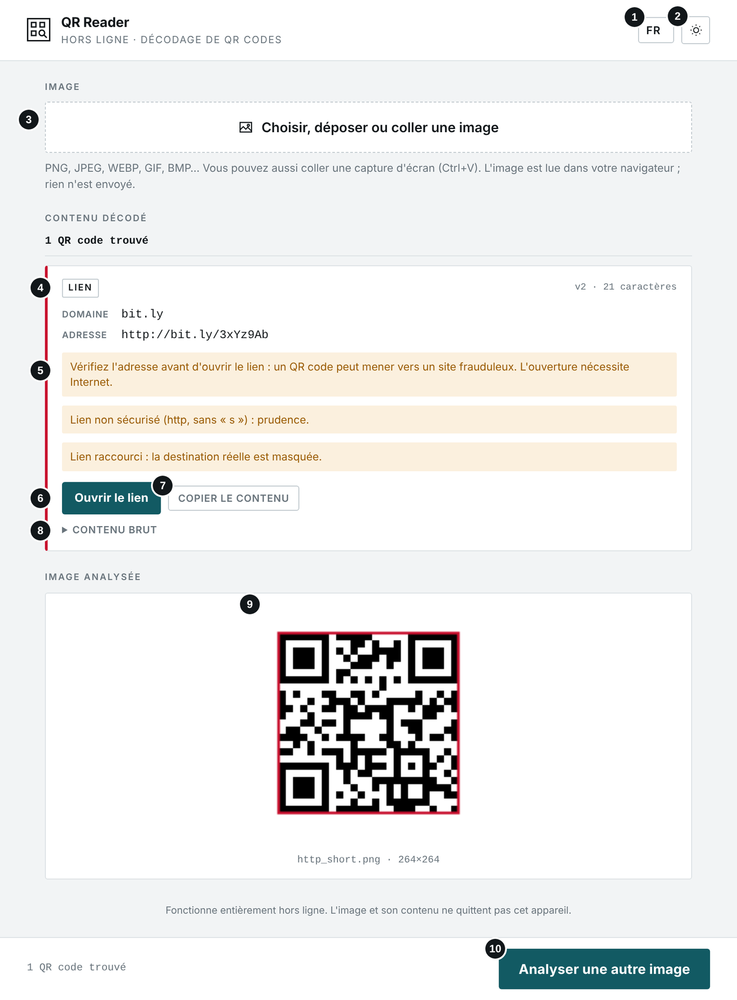
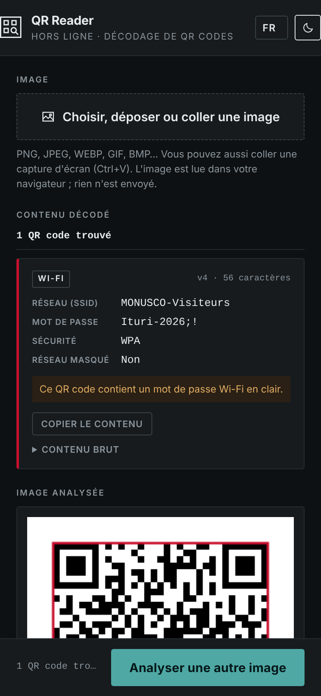
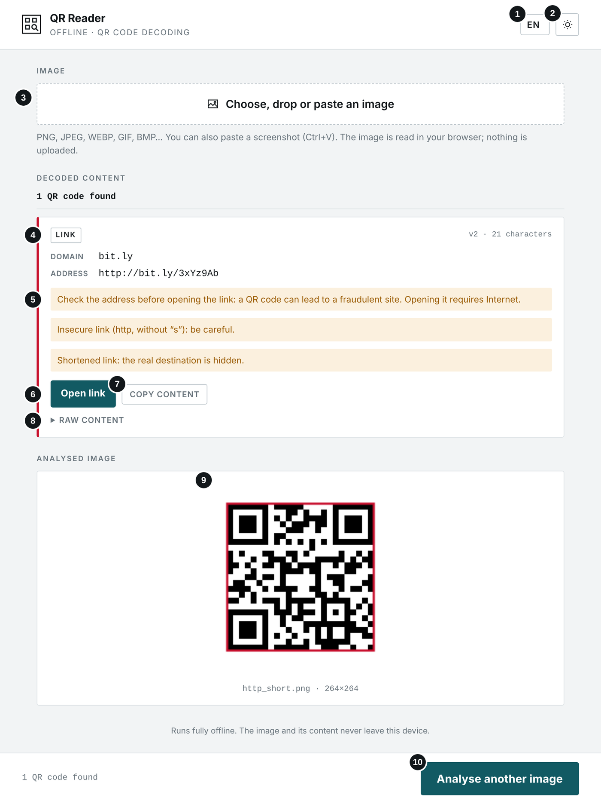
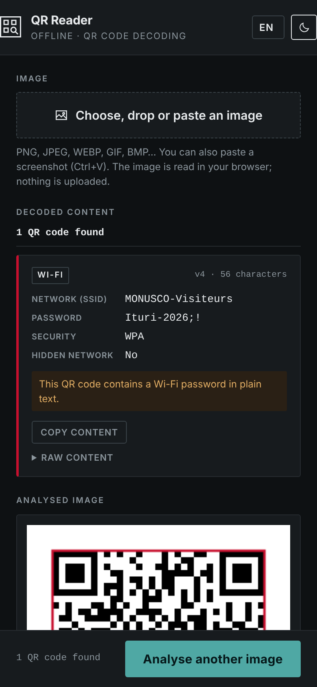
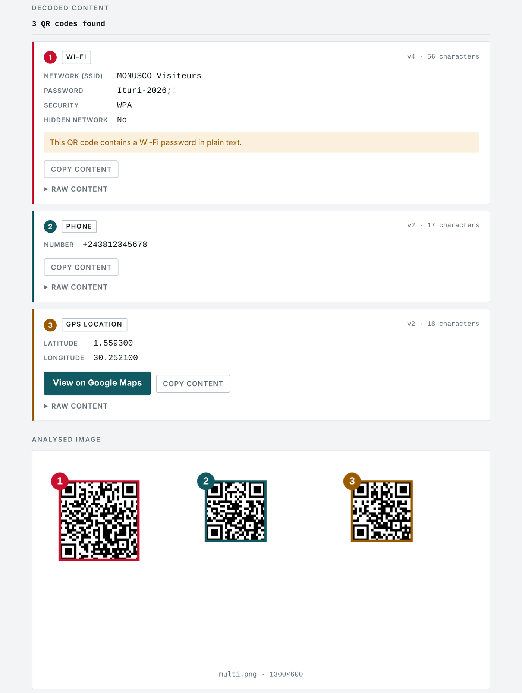

# QR Reader

**`QR_READER.html`** · Hors ligne · Aucune installation · Aucun envoi — *Offline · No install · No upload*

**[Français](#français) · [English](#english)**

---

## Français

### À quoi sert cet outil

Cet outil lit les QR codes contenus dans une image (photo, capture d'écran, document numérisé) et affiche leur contenu en clair : lien, texte, adresse, identifiants Wi-Fi, e-mail, numéro de téléphone, SMS, position GPS, carte de contact ou événement.

### Avant de commencer

- Ouvrez le fichier QR_READER.html par double-clic : il s'affiche dans votre navigateur (Chrome, Edge, Firefox ou Safari récents). Aucune installation n'est nécessaire.
- L'outil fonctionne sans connexion Internet. Aucun fichier n'est envoyé : tout le traitement se fait sur votre appareil. Seule l'ouverture d'un lien ou de Google Maps nécessite Internet.
- La langue (FR, EN, SW, LN) se choisit en haut à droite ; le bouton voisin bascule entre thème clair et sombre. Ces choix sont mémorisés.

### L'écran en un coup d'œil

1. Langue de l'interface
2. Thème clair ou sombre
3. Choisir, déposer ou coller (Ctrl+V) une image
4. Type de contenu reconnu
5. Avertissements de sécurité
6. Ouvrir le lien (uniquement sur votre clic)
7. Copier le contenu
8. Contenu brut : texte exact du QR code
9. Image analysée, QR code encadré
10. Analyser une autre image

#### Sur téléphone (thème sombre)

### Utilisation pas à pas

1. Cliquez sur « Choisir, déposer ou coller une image », faites glisser l'image sur la page, ou collez une capture d'écran avec Ctrl+V. Sur téléphone, le bouton permet aussi de prendre une photo.
2. Le décodage est immédiat : le contenu s'affiche sous forme de fiche, avec son type et ses informations.
3. Lisez les avertissements éventuels, puis copiez le contenu ou ouvrez le lien après l'avoir vérifié.
4. Dépliez « Contenu brut » pour voir le texte exact du QR code.
5. Si l'image contient plusieurs QR codes, chacun est numéroté sur l'image et décrit dans sa propre fiche.

#### Contenus reconnus

| Type | Informations affichées |
|---|---|
| **Lien** | Domaine, adresse complète, bouton « Ouvrir le lien ». |
| **Texte / adresse** | Le texte complet. |
| **Wi-Fi** | Nom du réseau, mot de passe, sécurité, réseau masqué. |
| **E-mail** | Destinataire, objet, message. |
| **Téléphone / SMS** | Numéro et, pour un SMS, le message. |
| **Position GPS** | Latitude, longitude, bouton Google Maps. |
| **Contact** | Nom, organisation, fonction, téléphone, e-mail, adresse. |
| **Événement** | Titre, début, fin, lieu. |

### Résultat

*Exemple avec trois QR codes dans une même image : chacun est numéroté et décodé séparément.*

### Bonnes pratiques

- N'ouvrez jamais un lien sans avoir vérifié son domaine : un QR code peut mener vers un site frauduleux.
- Pour une pièce de procédure, copiez le contenu brut et conservez l'image d'origine avec son empreinte (Forensic Hash Calculator).
- Pour une photo difficile à lire, recadrez autour du QR code et évitez reflets et flou.
- Un QR code Wi-Fi contient le mot de passe en clair : traitez-le comme une information sensible.

### En cas de problème

| Problème | Solution |
|---|---|
| **« Aucun QR code détecté »** | Image floue, code trop petit ou abîmé. Recadrez autour du code ou reprenez une photo plus nette. |
| **« Ce fichier n'est pas une image lisible »** | Format non reconnu par le navigateur. Les photos HEIC d'iPhone doivent être converties en JPEG. |
| **« Ouvrir le lien » ne fait rien** | Pas de connexion Internet, ou fenêtre bloquée par le navigateur. |
| **Un code-barres classique n'est pas lu** | L'outil lit uniquement les QR codes, pas les codes EAN, Data Matrix, etc. |

### Confidentialité

L'outil fonctionne entièrement sur votre appareil, sans connexion Internet. Aucune donnée n'est transmise ni conservée.

---

## English

### What this tool is for

This tool reads the QR codes contained in an image (photo, screenshot, scanned document) and shows their content in plain form: link, text, address, Wi-Fi credentials, e-mail, phone number, text message, GPS location, contact card or event.

### Before you start

- Double-click QR_READER.html: it opens in your browser (recent Chrome, Edge, Firefox or Safari). Nothing to install.
- The tool works without an Internet connection. No file is uploaded: everything is processed on your device. Only opening a link or Google Maps needs Internet.
- Choose the language (FR, EN, SW, LN) at the top right; the button next to it switches between light and dark theme. Both choices are remembered.

### The screen at a glance

1. Interface language
2. Light or dark theme
3. Choose, drop or paste (Ctrl+V) an image
4. Recognised content type
5. Security warnings
6. Open the link (only when you click)
7. Copy the content
8. Raw content: exact text of the QR code
9. Analysed image, QR code outlined
10. Analyse another image

#### On a phone (dark theme)

### Step by step

1. Click “Choose, drop or paste an image”, drag the image onto the page, or paste a screenshot with Ctrl+V. On a phone, the button can also take a photo.
2. Decoding is immediate: the content appears as a card, with its type and details.
3. Read any warnings, then copy the content or open the link once you have checked it.
4. Expand “Raw content” to see the exact text of the QR code.
5. If the image contains several QR codes, each one is numbered on the image and described in its own card.

#### Recognised content

| Type | Information shown |
|---|---|
| **Link** | Domain, full address, “Open link” button. |
| **Text / address** | The full text. |
| **Wi-Fi** | Network name, password, security, hidden network. |
| **Email** | Recipient, subject, message. |
| **Phone / SMS** | Number and, for an SMS, the message. |
| **GPS location** | Latitude, longitude, Google Maps button. |
| **Contact** | Name, organisation, position, phone, e-mail, address. |
| **Event** | Title, start, end, location. |

### Result

*Example with three QR codes in one image: each one is numbered and decoded separately.*

### Good practice

- Never open a link without checking its domain: a QR code can lead to a fraudulent site.
- For case evidence, copy the raw content and keep the original image with its hash (Forensic Hash Calculator).
- For a photo that is hard to read, crop around the QR code and avoid glare and blur.
- A Wi-Fi QR code contains the password in plain text: treat it as sensitive information.

### Troubleshooting

| Problem | Solution |
|---|---|
| **“No QR code detected”** | Blurry image, code too small or damaged. Crop around the code or take a sharper photo. |
| **“This file is not an image the browser can read”** | Format not recognised by the browser. iPhone HEIC photos must be converted to JPEG. |
| **“Open link” does nothing** | No Internet connection, or the window is blocked by the browser. |
| **A regular barcode is not read** | The tool only reads QR codes, not EAN, Data Matrix or other codes. |

### Privacy

The tool runs entirely on your device, without an Internet connection. No data is sent or kept.

---

*Bibliothèque intégrée / Embedded library: jsQR 1.4.0 (Apache 2.0).*
